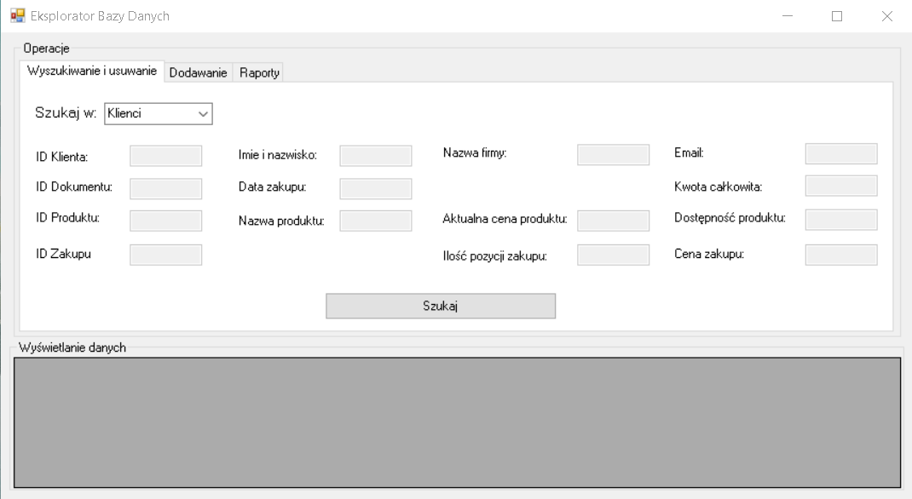
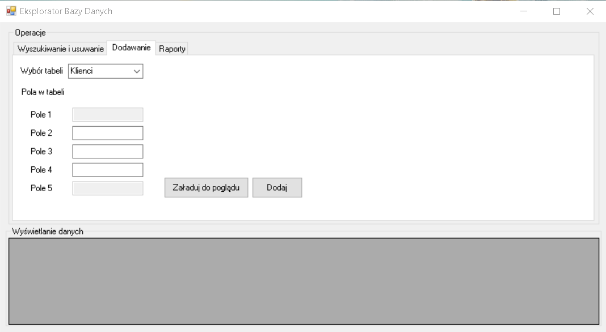
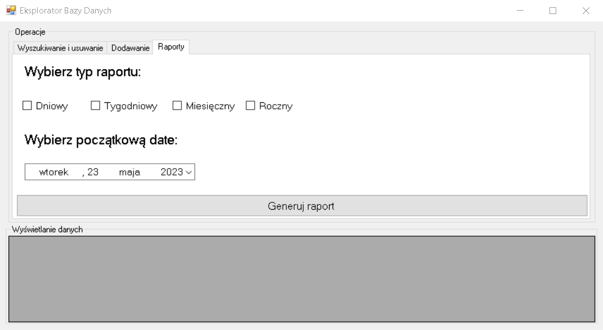

# Shop Database Application

This is a database application designed for efficient and convenient searching of purchase history in a shop. The application is targeted towards store managers or accounting staff.

## Features

The main features of the application include:

- **Search Functionality**: Users can search the database for purchase records using various parameters such as invoice number, purchase date, customer name, product name, or order value.

- **Clear and Informative Display**: The application provides a user-friendly interface that presents information about customers, products, and order details in a clear and readable format.

- **Interactive Database Operations**: Users can easily add, edit, and delete records in the database through intuitive and user-friendly operations.

- **Sales Statistics Reporting**: The application offers the option to generate reports with sales statistics according to user-defined criteria, such as reports for specific months.

## Architecture

The application is composed of three main sections:

- **Frontend Layer**: This layer enables users to interact with the application through a graphical user interface, handling user-triggered events.

- **Backend Layer**: This layer converts user inputs into database queries using appropriate scripts, facilitating the communication with the integrated database.

- **Integrated Database**: The application utilizes a well-structured database comprising four primary tables:

  - **Customers**: This table stores information about companies and individuals who have made purchases at the shop. It includes fields such as customer ID, name or company name, and contact details.

  - **Products**: This table contains information about the products available in the shop, including product ID, name, price, and availability.

  - **Receipts**: This table holds information about receipts/invoices, including receipt ID, purchase date, customer ID, and purchase amount.

  - **Purchases**: This table stores information about individual purchases, including receipt ID, product ID, quantity, and purchase price.

## Technologies Used

The application is developed using the following technologies:

- **C#**: The programming language used for building the application.

- **NHibernate**: An ORM (Object-Relational Mapping) framework based on Microsoft SQL Server, used for database interactions.

- **.NET Framework**: The development framework providing the environment for the application.

## Installation and Usage

To use the application locally, follow these steps:

1. Clone this repository to your local machine.
2. Open the solution file (`Projekt_bazodanowy.sln`) in Visual Studio.  
   **Note!** 
   Make sure that your SQL Server database is set up correctly:
    - For table creation use (`TableCreation.sql`).
    - For sample data input use (`SampleDataCreation.sql`).
    - Make sure yours database name matches name in Form1.cs in connStr.
3. Build the solution to restore dependencies and compile the application.
4. Run the application and start exploring the features through the intuitive graphical user interface.

## User Interface Design

The user interface of the application incorporates elements for searching items with customizable parameters and search filters. It also allows for editing the contents of tables, such as adding new customers, removing outdated products, and editing prices and receipts.

Here are some screenshots that demonstrate the user interface of our application:

  
*Figure 1: The login screen of the application.*

  
*Figure 2: The search screen of the application.*

  
*Figure 3: The add screen of the application.*

  
*Figure 4: The report screen of the application.*
## Acknowledgements

The project was developed by Kacper Przybyszewski and Karol Porożyński as a database project for a shop application.
